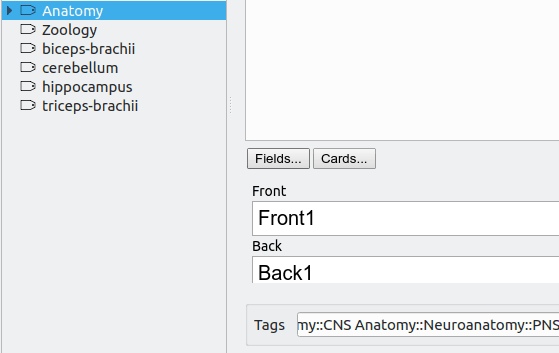

<h2 align="center">BetterTags Add-on for Anki</h2>

This repo hosts the bug tracker for [BetterTags](https://www.patreon.com/glutanimate/posts?tag=BetterTags), an [Anki add-on](https://www.patreon.com/glutanimate) that is currently limited to [my Patreon supporters](https://www.patreon.com/glutanimate). BetterTags Anki's tagging system, introducing features like drag-and-drop rearrangement and an advanced search-and-replace interface with RegEx support.

Please feel free to use this repo to report any bugs you run into, or suggest new features for the add-on.

----

<b>

The continued development of this add-on is made possible  thanks to my <a href="https://www.patreon.com/glutanimate">Patreon</a> and <a href="https://ko-fi.com/X8X0L4YV">Ko-Fi</a> supporters.
 You guys rock ❤️ !

</b>